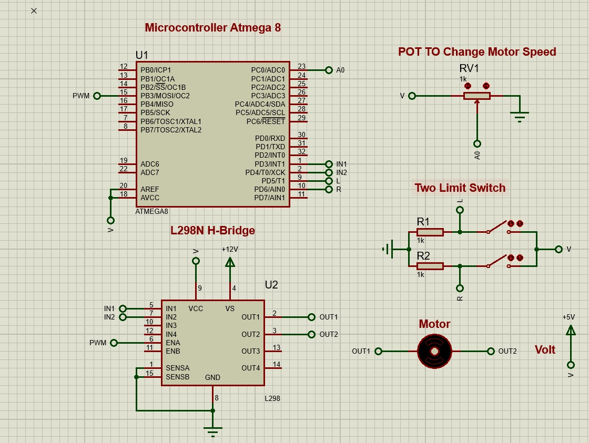

# Motor Speed and Direction Control using ATmega8 and Proteus
This project demonstrates how to control a DC motor's speed and direction using an ATmega8 microcontroller, simulated in Proteus with Embedded C.

# Features
  * Control motor direction (Clockwise/Counter-clockwise)
  * Adjust motor speed using PWM
  * Simulated in Proteus
  * Embedded C code for ATmega8

# Components
  * ATmega8 Microcontroller
  * L298N Motor Driver IC
  * DC Motor
  * Potentiometer (for speed control)
  * Push buttons (for direction control)
  * 12V Power Supply
  * Proteus Simulation Software
  * AVR-GCC Compiler (e.g., Atmel Studio/AVRDUDE)

# Circuit Explanation
  - The L298N motor driver is used to drive the motor.
  - PWM signal from ATmega8 controls the motor speed.
  - Two push buttons change the direction of the motor.
  - A potentiometer is used to vary the PWM duty cycle.

# Pin Connections
  - ATmega8 Pins:
    * PB3 (OC0) → L298N Enable (PWM for Speed)
    * PD3 → L298N Input 1
    * PD4 → L298N Input 2
    * PC0 → Potentiometer (ADC Input for Speed Control)
    * PD5 → Direction Button 1
    * PD6 → Direction Button 2
      
#  Motor Control Circuit

